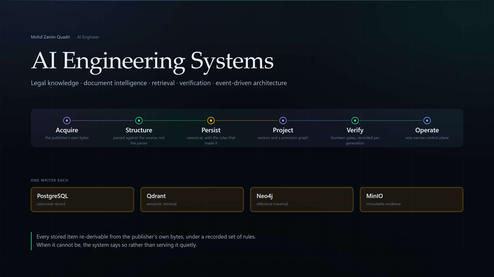
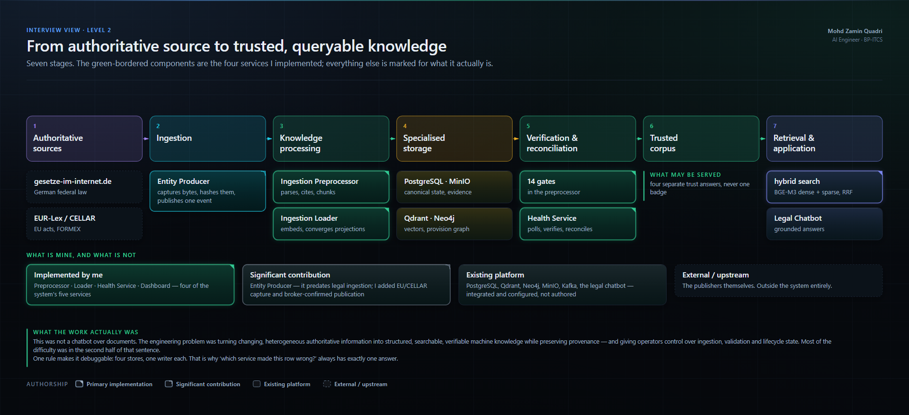

# AI Engineering Systems — architecture case studies

**Mohd Zamin Quadri · AI Engineer**

> **Personal engineering portfolio by Mohd Zamin Quadri.** Selected architecture
> case studies based on systems I **contributed to** while working at
> **BP-ITCS**. This repository is **not official BP-ITCS documentation**, and
> sensitive or internal implementation details have been **generalised or
> omitted**.
>
> Authorship is stated per component across five classes — see
> [My contribution](#my-contribution) and the
> [public architecture note](#public-architecture-note).

Four AI workstreams over one event-driven platform: a verifiable legal knowledge
base, the insurance AI compliance product it serves, document intelligence over
insurance paperwork, and a prototype medical-imaging classifier with
explainability.



---

## What I worked on

- **Four of the five services** in the Legal Knowledge Database: the ingestion
  preprocessor, the loader, the control-plane API and the operator dashboard.
- **A verification layer of 14 gates** that measures what is stored against what
  the publisher actually served — including an oracle built on a deliberately
  different XML stack, so it cannot share a defect with the parser it checks.
- **Multi-store consistency without a distributed transaction**, by deriving
  every identifier from canonical content so that redelivery converges instead
  of duplicating.
- **Two XML parsers** — German GII-NORM and EU FORMEX v4 — with citation
  extraction down to provision level.
- **Hybrid retrieval** with BGE-M3 dense and sparse vectors fused server-side,
  and a hard refusal rather than a silently truncated embedding.
- **Extended a document-intelligence pipeline**: template-driven LLM field
  extraction, multi-format input, and detection of the corruption that looks
  like success.
- **Built the ML core of a prototype medical-imaging classifier** (internally
  &ldquo;AI Radiologist&rdquo;): per-finding calibrated thresholds from
  Youden&rsquo;s J, a severity and ICD-10 layer, and Grad-CAM++ attribution.
  A research prototype — not a medical device, not clinically deployed.
- **Wired the ingestion side of the insurance AI compliance product**, whose
  cited compliance reports are the reason the legal corpus has to be verifiable
  rather than merely searchable.

## Architecture at a glance



Seven stages. The green-bordered components are the four services I implemented;
everything else is marked for what it actually is — significant contribution,
existing platform, or external.

## What made the system technically interesting

**Multi-store knowledge consistency.** Four stores, one writer each. A Qdrant
point id is `uuid5(namespace, chunk_id)`; a graph node is `MERGE`-d by id. Every
derived identifier is a pure function of canonical content, which is what makes
Kafka redelivery safe across three heterogeneous stores with no coordinated
commit.

**Evidence provenance.** The publisher's bytes are hashed before anything parses
them, stored under a fresh prefix per capture, and mirrored into an
object-locked bucket. Each stored generation additionally records three digests
over the parser, the reference extractor and the registry — so a byte change in
a rule is detectable as a rule change.

**Independent verification.** The module that supplied the parser's completeness
denominator was also the module the gate re-ran to check it, which makes a
defect inside it common-mode. The answer was a second reading of the same markup
on a different XML stack, importing no parser code — and a prover that validates
itself before issuing any verdict.

**Source freshness.** Currency is split across two services on purpose: one
polls the publisher and writes an observation bound to a capture id, the other
judges that evidence and never fetches. Observer and judge stay separate.

**Operator-driven lifecycle.** Re-ingest, verify, reconcile and withdraw, from
one narrow control plane. Only two of the four change the corpus, and both sit
behind two independent flags. Nothing self-heals — deliberately, for a legal
corpus.

**Event-driven ingestion.** Ten topics across two pipelines. Ingestion has no
REST trigger, so first ingest, re-ingest and replay are the same code path, and
the recovery path is exercised daily.

**Document intelligence.** Docling conversion, then template-driven extraction
where the template — not the model — is the contract, so the model can change
without the pipeline changing.

**Calibration over convenience.** The imaging classifier uses one decision
threshold per finding rather than a global cut-off: cardiomegaly is positive at
`0.130`, effusion only at `0.424`. Presence and urgency are answered separately,
because a confident low-acuity finding is not an emergency.

**Explanations that can disagree with you.** A per-finding anatomical prior
exists in the code and is switched off — `USE_ANATOMICAL_HINTS = False`,
commented &ldquo;trust Grad-CAM fully&rdquo;. *My reading* of that decision is
that such a prior could bias localisation towards expected anatomy, so the
attribution would tend to agree with the label rather than show what the model
used; the source documents the first half of that, not the second.

## My contribution

| Class | What |
|---|---|
| **Primary implementation** | Ingestion Preprocessor (466/498 commits) · Ingestion Loader (77/94) · Legal KB Health Service (123/148) · Legal KB Dashboard (144/167) |
| **Significant contribution** | Entity Producer — EU/CELLAR ingestion, broker-confirmed publication · Document Extractor — dual LLM+regex extraction · Indexing Service — I created it · shared `ai-utils` library · Medical-imaging prototype — Grad-CAM++ analyser, DenseNetV2 integration, calibrated per-finding thresholds |
| **Integration / shared** | The questionnaire ingestion path — a colleague-authored feature integrated inside a service I implemented · Glaux UI, entity-handler and shared utils — bounded changes only in each |
| **Existing platform** | The Java entity platform, the AI Compliance UI and backend, the RAG service (0 of 56 commits), the legal chatbot, and every third-party store |

Commit shares are `git shortlog -sne` on 2026-09-12. A commit count is evidence
of weight, not of authorship — two classifications deliberately disagree with it
and say so on the
[contribution diagram](assets/png/12-my-contributions.png).

**Not claimed:** no production deployment (Docker Compose with CI-built images,
in a lab), no business impact metrics (none exist in any repository), and no EU
law is certified — the parsers work, the assurance contract for them does not
exist yet. The medical-imaging work is a **research prototype**: no medical
device, no regulatory clearance, no clinical validation or deployment, and no
accuracy figure is claimed.

## Architecture deep dives

| | |
|---|---|
| **Legal Knowledge Database** | [full architecture](assets/architecture/02-legal-knowledge-database.svg) · [notes](docs/architecture/architecture-notes.md) |
| **Verification & reconciliation** | [the short version](assets/architecture/17-verification-essence.svg) · [the 14 gates](assets/architecture/06-verification-and-reconciliation.svg) · [how the claims were proved](docs/architecture/evidence-summary.md#the-verification-claims-proved-against-source) |
| **RAG / query path** | [retrieval and grounded answering](assets/architecture/07-rag-query-flow.svg) |
| **Document lifecycle** | [eleven stages](assets/architecture/03-document-ingestion-lifecycle.svg) · [state machine](assets/architecture/15-document-state-machine.svg) |
| **Medical imaging** | [classification, calibration and attribution](assets/architecture/18-ai-radiologist.svg) — research prototype |
| **AI Compliance** | [the product the corpus serves](assets/architecture/19-ai-compliance.svg) |
| **Contribution map** | [every repository, classified](assets/architecture/12-my-contributions.svg) |
| **Failure & recovery** | [fifteen documented failures](assets/architecture/14-failure-recovery-and-trust.svg) |
| **Design decisions** | [ARCHITECTURE_DECISIONS.md](ARCHITECTURE_DECISIONS.md) — context, reason, trade-off, limitation |

All 20 diagrams: [`assets/architecture/`](assets/architecture/) as SVG,
[`assets/png/`](assets/png/) as PNG, [`assets/drawio/`](assets/drawio/) as
editable diagrams.net sources, [`assets/mermaid/`](assets/mermaid/) as simplified
Mermaid.

## Interview deck

[**ai-engineering-portfolio.pdf**](presentation/ai-engineering-portfolio.pdf)
· [PPTX](presentation/ai-engineering-portfolio.pptx) — twelve slides, each
answering one question. Individual slides as PNG in
[`presentation/slides/`](presentation/slides/).

## Rebuilding any of it

Every generator under `tools/` runs on a bare Python install, with one
exception: `tools/gen_deck.py` writes the PowerPoint file and needs
`python-pptx`, which is the only line in `requirements.txt`. It is imported
inside the function that uses it, so the two publication gates and every other
generator run without installing anything.

```bash
python tools/check_public.py        # the redaction review, re-runnable
python tools/check_links.py         # every internal reference resolves
python tools/check_stdlib_only.py   # no undeclared dependency crept in

pip install -r requirements.txt     # only needed for the line below
python tools/gen_deck.py
```

All three gates run on every push.

## Interactive architecture

```bash
start index.html      # Windows
open  index.html      # macOS
```

One self-contained file with every diagram inlined as SVG. No build step, no
server, no CDN — it opens from the filesystem and deploys unchanged to any
static host.

Two controls worth using: **Highlight my work** dims everything that is not
primary authorship across every diagram at once, and **Interview walkthrough**
runs an eleven-step guided sequence.

Regenerate everything with `python tools/gen_diagrams.py && python tools/gen_site.py`
— see [`tools/`](tools/). A diagram whose text would not fit raises rather than
rendering clipped, so a clean build is evidence that no label is truncated.

## Public architecture note

This is a public, generalised description of systems built at BP-ITCS.
Infrastructure detail has been removed rather than obscured: no credentials, no
internal hostnames or IP ranges, no container registry paths, no internal model
endpoints, no client documents, and no screenshots of internal data. Service
names, Kafka topic names, store and collection names and gate identifiers are
published, because they are private-network identifiers with no routable meaning
and the architecture cannot be explained without them.

The redaction reasoning is summarised in
[evidence-summary.md](docs/architecture/evidence-summary.md#what-was-redacted-and-why),
the two remaining judgement calls are in
[PUBLICATION_DECISIONS.md](PUBLICATION_DECISIONS.md), and the automated gate is
`python tools/check_public.py`.

---

<sub>Twenty repositories were read before anything was drawn, and every claim is
traceable to a file. The method and the headline findings are in
[evidence-summary.md](docs/architecture/evidence-summary.md); the full trail —
ten documents naming exact paths, per-repository authorship and three
documentation-versus-code discrepancies — is held privately and available on
request.</sub>
