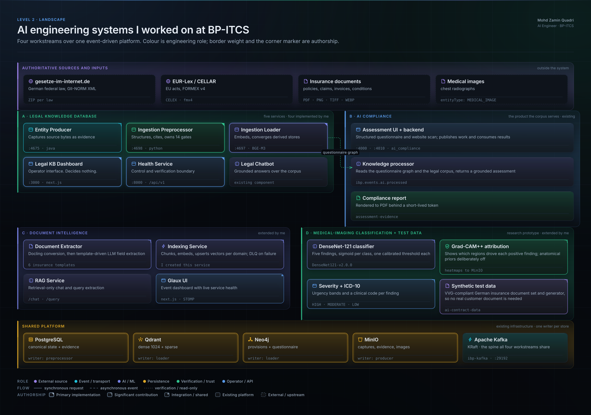
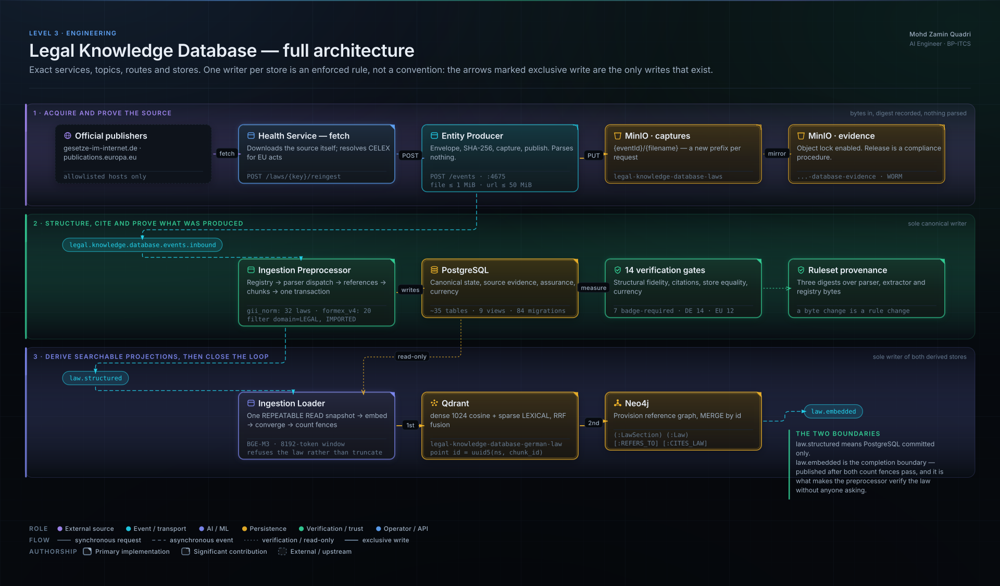
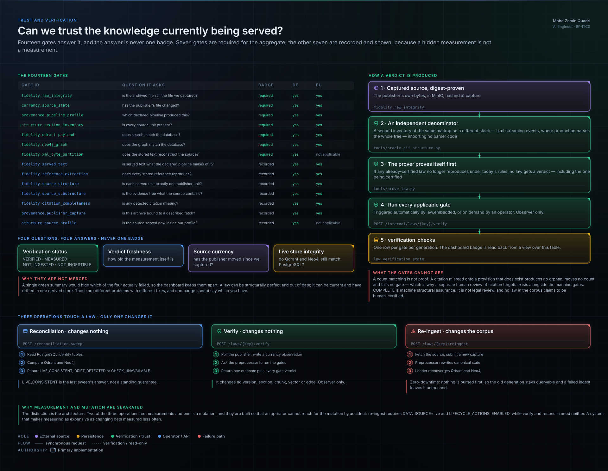
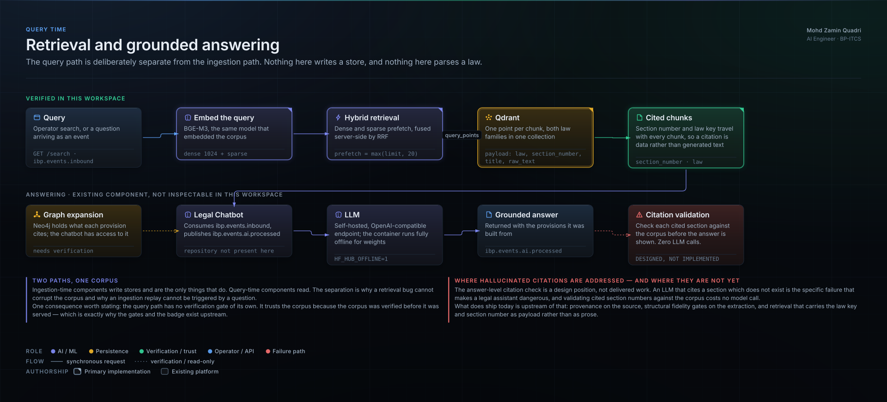

# Architecture

*Part of a personal engineering portfolio describing work contributed to at
BP-ITCS. Not official company documentation, and not the complete internal
architecture.*

Four AI workstreams over one event-driven platform: a verification-first legal
knowledge base, the insurance AI compliance product it serves, document
intelligence over insurance paperwork, and a chest X-ray classifier with
calibrated thresholds and explainability.

The legal system turns published law into machine-readable knowledge that can
prove what it contains — and refuses to serve what it cannot prove.

The **Legal Knowledge Database** is five deployable services in two groups: a
three-stage **ingestion pipeline** (entity producer → preprocessor → loader) and
a two-part **control plane** (health service + dashboard). I implemented four of
the five; the entity producer predates legal ingestion and I extended it.

## The problem it solves

Authoritative information changes, and it changes without telling you. German
and EU legislation are published as XML in two unrelated markup families. Once
you extract that into vectors and a graph for retrieval, you hold three
representations of the same law, any of which can drift from the source it came
from. A confident wrong answer about a statute is worse than no answer.

So the hard part was never retrieval. It was provenance, structural fidelity,
and giving a person control over ingestion and lifecycle state.



## How data moves

```
publisher  ──►  capture + SHA-256  ──►  structure and cite  ──►  canonical rows
                                                                      │
                       ┌──────────────────────────────────────────────┘
                       ▼
               embed + converge  ──►  vectors + provision graph  ──►  verify
                                                                        │
                                                     grounded retrieval ◄┘
```

Three Kafka topics carry it, and two of them are boundaries with different
meanings:

| Topic | Means |
|---|---|
| `legal.knowledge.database.events.inbound` | a capture exists; here is its envelope and digest |
| `legal.knowledge.database.law.structured` | canonical PostgreSQL is committed — **and nothing more** |
| `legal.knowledge.database.law.embedded` | both derived stores are durably converged: the **completion boundary** |

`law.embedded` is what makes the preprocessor run its verification gates without
anyone asking it to.



## How trust is established

Fourteen gates measure what is stored against what the publisher served. Seven
are required for the aggregate badge; all fourteen are recorded and displayed,
because a measurement nobody can see is not a measurement.

Three properties make the answer meaningful rather than self-confirming:

- **An independent denominator.** The inventory the extraction is checked
  against is a second reading of the same markup on a different XML stack —
  `lxml` streaming events where production parses the whole tree — and it
  imports no parser code. A defect cannot be common to both.
- **The prover proves itself first.** If any already-certified law no longer
  reproduces under today's rules, no law gets a verdict — including the one
  being certified.
- **Ruleset provenance.** Each stored generation records digests over the
  parser, the reference extractor and the registry. A byte change is a rule
  change, whether or not behaviour moved.



## How AI is used

| Stage | Model | What it does |
|---|---|---|
| Embedding | BGE-M3 (`BAAI/bge-m3`) | dense 1024 + sparse LEXICAL in one pass, 8192-token window |
| Retrieval | Qdrant | dense and sparse prefetch, fused server-side with reciprocal rank fusion |
| Answering | self-hosted OpenAI-compatible LLM | grounded answers over retrieved provisions |
| Document conversion | Docling Serve | PDF and image bytes to Markdown |
| Field extraction | configurable LLM | template-driven discovery, guided extraction and re-extraction |
| Classification | DenseNet-121 | chest X-ray multi-label, sigmoid per class, one calibrated threshold per finding, Grad-CAM++ attribution |

One refusal matters more than any of the above. FlagEmbedding truncates silently
past the model's token window, so the loader counts tokens first and raises for
the whole law rather than storing a vector for text the model never fully saw. A
silently truncated embedding has the right dimensionality, sits in the right
collection, and is wrong.



## Technologies

**Services** — Python 3.13 with FastAPI; Java with Spring Boot; TypeScript with
Next.js 16.
**Data** — PostgreSQL 17, Qdrant, Neo4j, MinIO, MongoDB.
**Messaging** — Apache Kafka in KRaft mode.
**AI** — FlagEmbedding / BGE-M3, PyTorch, Docling Serve, Ollama, an
OpenAI-compatible inference endpoint.
**Platform** — Docker Compose, Keycloak, OpenTelemetry, Jaeger, Playwright.

## What I worked on

| | |
|---|---|
| **Implemented** | Ingestion Preprocessor (466/498 commits) · Legal KB Dashboard (144/167) · Legal KB Health Service (123/148) · Ingestion Loader (77/94) |
| **Extended** | Entity Producer — EU/CELLAR ingestion via Claim-Check · Document Extractor — dual LLM + regex extraction · Indexing Service — originated it · `ai-utils` · AI Prediction Service — Grad-CAM++, DenseNetV2, severity thresholds |
| **Integrated** | The Java entity platform, the RAG service, the Glaux UI, the legal chatbot, and every third-party store |

Commit shares are `git shortlog -sne` as of 2026-09-12. A commit count is
evidence of weight, not of line ownership.

## Scope and honesty

- **Production-oriented, not in production.** Only Docker Compose stacks and CI
  image builds are evidenced. No Kubernetes manifest or cloud infrastructure
  exists in the repositories.
- **No business impact metrics.** None exist in any repository, so none are
  claimed.
- **The legal pipeline has no dead-letter topic**, no bounded retry and no
  automatic repair. That is a deliberate position for a legal corpus and a real
  gap; both are stated in the diagrams.
- **No EU law is certified.** EU acts parse, ingest and are queryable, but the
  pre-flight detectors are GII-shaped so the prover returns `INCONCLUSIVE`.
- **Credentials, internal hostnames and endpoints appear nowhere** in this
  package. See the redaction review linked below.

## More

- [architecture-notes.md](architecture-notes.md) — the detail behind each
  diagram
- [Interactive portfolio](../../index.html) — the full set of twenty diagrams
  with an authorship overlay and a guided interview walkthrough
- [Interview walkthrough](../../INTERVIEW_WALKTHROUGH.md) — 30-second,
  2-minute, 5-minute and 10-minute versions, with likely questions
- [Architecture decisions](../../ARCHITECTURE_DECISIONS.md) — context,
  decision, reason, trade-off, alternative and limitation for each
- [Evidence summary](evidence-summary.md) — the method, and how the
  verification claims were proved against source
- [Publication decisions](../../PUBLICATION_DECISIONS.md) — what was withheld,
  and the two calls that remain
